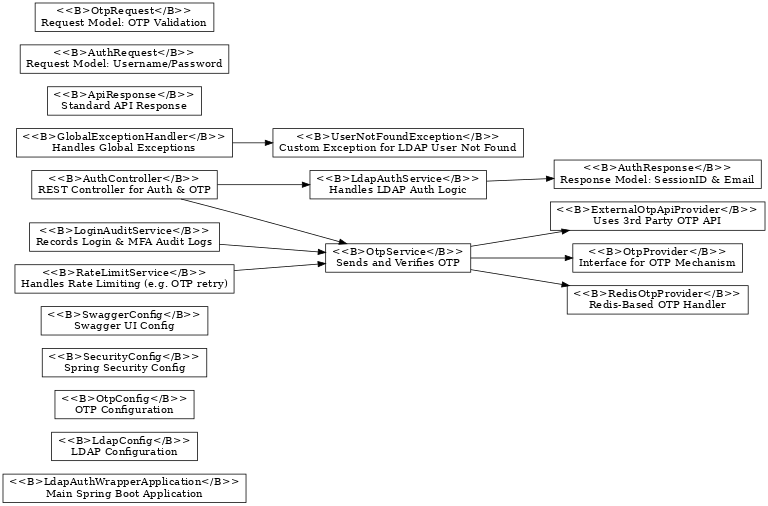
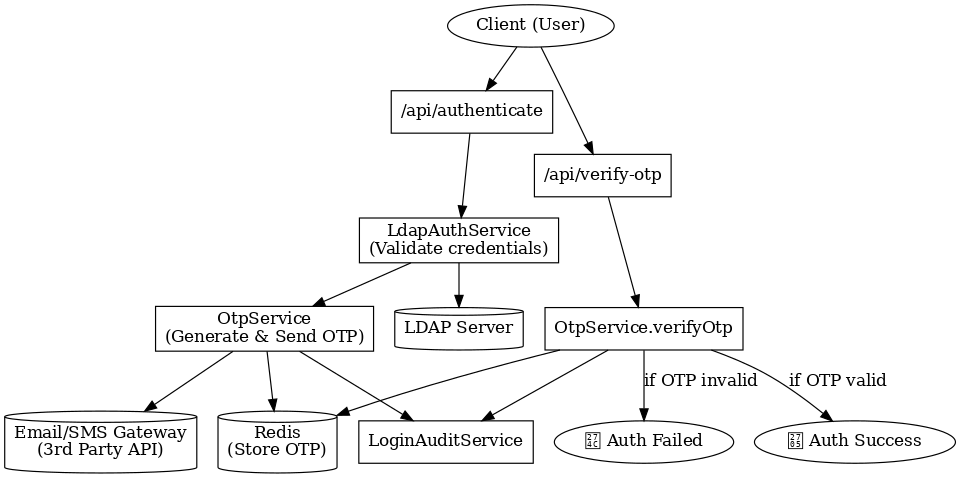
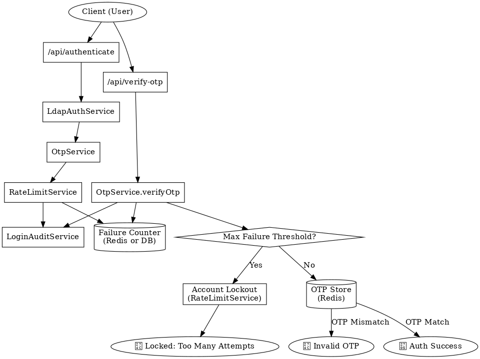
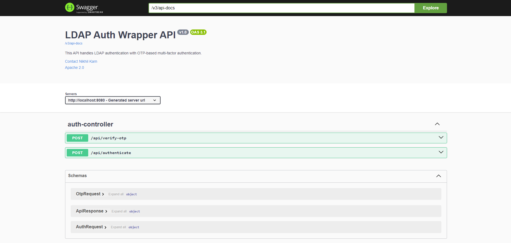

# 🔐 LDAP MFA Authentication Wrapper

### Author: Nikhil Karn

This is a **client-installable, platform-independent** Spring Boot wrapper that provides:

- ✅ LDAP authentication using Bind DN + search filter
- 🔁 Multi-tenant LDAP support with failover and pooling
- 🔒 MFA (Email-based OTP via pluggable provider APIs)
- 📊 Rate limiting and account lockout features
- 🧠 Intelligent auditing and brute-force attack detection
- 📦 Deployable as a WAR or standalone JAR
- 🚀 Redis-based OTP caching for stateless scaling
- 🐳 Docker-ready packaging for any environment
- 🧪 90%+ JUnit test coverage target with CI/CD ready setup
- 📝 Auto-generated Swagger API documentation

---

## 🔧 Build & Run

### Option 1: Run as JAR
```bash
./mvnw clean package
java -jar target/ldap-auth-wrapper.war
```

---

## 🧪 Sample API Usage

### 1. Authenticate and Trigger OTP
```bash
curl -X POST http://localhost:8080/api/authenticate   -H "Content-Type: application/json"   -d '{"username": "einstein", "password": "password"}'
```

### 2. Verify OTP
```bash
curl -X POST http://localhost:8080/api/verify-otp   -H "Content-Type: application/json"   -d '{"username": "einstein", "otp": "123456"}'
```

---

## 📜 Configuration (application.yml)

```yaml
ldap:
  urls:
    - ldap://ldap.forumsys.com:389
  base-dn: dc=example,dc=com
  bind-dn: cn=read-only-admin,dc=example,dc=com
  bind-password: password
  user-search-filter: (uid={0})

otp:
  provider: redis
  redis:
    ttl-seconds: 300
    host: localhost
    port: 6379
  email:
    sender: otp@authwrapper.com
    subject: Your OTP Code
    body-template: Hello {username}, your OTP is {otp}.
```

---

## 🧠 Diagrams

### Class Diagram


### Authentication & MFA Flow


### Advanced Flow – MFA + Rate Limiting + Lockout


---

## 📘 Swagger Docs

📘 Swagger UI: [http://localhost:8080/swagger-ui/index.html](http://localhost:8080/swagger-ui/index.html)

### 📘 Swagger Docs Snapshot


---

## 📁 Project Structure

```
src/main/java/com/nikhilkarn/authwrapper
            │   LdapAuthWrapperApplication.java
            │
            ├───config
            │       LdapConfig.java
            │       OtpConfig.java
            │       SecurityConfig.java
            │       SwaggerConfig.java
            │
            ├───controller
            │       AuthController.java
            │
            ├───exception
            │       GlobalExceptionHandler.java
            │       UserNotFoundException.java
            │
            ├───model
            │       ApiResponse.java
            │       AuthRequest.java
            │       AuthResponse.java
            │       JwtTokenResponse.java
            │       MfaOtpKeyResponse.java
            │       MfaOtpVerifyRequest.java
            │       MfaSessionResponse.java
            │       OtpRequest.java
            │
            ├───provider
            │       ExternalOtpApiProvider.java
            │       OtpProvider.java
            │       RedisOtpProvider.java
            │
            ├───service
            │       LdapAuthService.java
            │       LoginAuditService.java
            │       OtpService.java
            │       RateLimitService.java
            │
            └───util
                    JwtUtil.java

```

---

## 🚧 Features Roadmap

| Feature                      | Status     |
|-----------------------------|------------|
| LDAP Bind Auth              | ✅ Done     |
| Multi-server failover       | ✅ Done     |
| Pluggable OTP Provider      | ✅ Done     |
| Redis OTP backend           | ✅ Done     |
| Swagger + JUnit             | ✅ Done     |
| Account Lockout             | ✅ Done     |

---

## 🔐 Security

- Secure LDAP bind (use StartTLS or LDAPS in production)
- Passwords cleared from memory after use
- OTPs expire in Redis; never stored in DB
- Rate limiting and account lockout policies
- All unexpected exceptions handled with generic responses

---

## 📫 Contact

If you'd like to extend this project or need consulting on IAM and security implementations:

**Email:** nik.karn92@gmail.com


---

## 📚 Detailed Answers 

### 🔐 Authentication & LDAP Integration

**Q1: How does the wrapper authenticate users against an LDAP directory?**  
The wrapper uses Spring Security's LDAP bind mechanism. It connects using a configured Bind DN and authenticates the user by binding as them and verifying credentials.

**Q2: What is the role of Bind DN and search filters in LDAP authentication?**  
Bind DN provides read access for user lookup. The search filter (e.g., `(uid={0})`) is used to find the full DN of the user before attempting bind authentication.

**Q3: How does the wrapper support multiple LDAP configurations like failover and load balancing?**  
The `application.yml` accepts a list of LDAP URLs. If one fails, it automatically attempts the next, enabling failover and round-robin-like behavior.

**Q4: What LDAP protocols are supported, and how is secure communication ensured?**  
Supports `ldap`, `ldaps`, and `StartTLS`. Secure modes (LDAPS/StartTLS) should be used in production with valid certificates.

**Q5: How are connection timeouts and connection pooling configured and managed?**  
Connection pool settings and timeouts can be set via Spring Boot’s `LdapContextSource` bean properties.

---

### 🔒 MFA (Email OTP) Integration

**Q1: What is the OTP verification flow after successful LDAP authentication?**  
After LDAP bind success, the wrapper generates and sends an OTP, which must be verified to complete the login flow.

**Q2: How is the OTP sent — via link, code, or both?**  
The system sends an OTP code via email. Future support for clickable links is planned.

**Q3: What happens if the OTP is not verified within a timeout period?**  
It expires from the Redis cache (TTL configurable). Any attempt to verify after expiry fails with an appropriate error.

**Q4: How is the MFA module designed to support additional methods in the future?**  
The `OtpProvider` interface allows plugging in custom providers like SMS, Authenticator apps, etc.

**Q5: How is stateless OTP verification implemented using Redis or similar cache?**  
OTPs are stored with expiry in Redis using a unique key tied to the username. No session state is retained in the backend.

---

### 📦 Wrapper Design & APIs

**Q1: What interfaces does the authentication wrapper expose — REST APIs, SDKs, or both?**  
Currently, only REST APIs are exposed via a clean, documented interface.

**Q2: How is the API documented (e.g., Swagger/OpenAPI)?**  
Using Springdoc OpenAPI with Swagger UI auto-generated from annotated controllers.

**Q3: How is the modular or hexagonal architecture implemented in the wrapper?**  
It uses a clear separation of controller, service, provider, and configuration layers following layered/hexagonal architecture principles.

**Q4: How is the library packaged — as a JAR, WAR, or both?**  
It is packaged as a WAR by default but can run standalone like a JAR.

**Q5: What are the best practices followed in code layering (e.g., controller, service, data)?**  
Each layer is cleanly separated with DTOs, services, and interfaces. Configuration is externalized.

---

### 🧪 Demo Client / Application

**Q1: How does the demo client interact with the authentication wrapper?**  
It performs REST calls to `/api/authenticate` and `/api/verify-otp` endpoints.

**Q2: Can the demo simulate both LDAP + Email OTP flows end-to-end?**  
Yes, it performs a full flow from credential validation to OTP verification.

**Q3: Is the demo client web-based, CLI, or desktop-based?**  
CLI-based using cURL or Postman, but extensible to any frontend.

**Q4: What authentication states are shown in the client (e.g., pending OTP, success, failure)?**  
Success, OTP sent, OTP failed/expired, and generic error messages are handled.

**Q5: How is error handling (e.g., invalid LDAP credentials or expired OTP) demonstrated?**  
HTTP response codes and structured error responses are returned for all failure scenarios.

---

### 📑 Documentation

**Q1: What details are included in the LDAP and email configuration setup?**  
`application.yml` covers LDAP URLs, DN, credentials, email templates, and Redis config.

**Q2: What are the key steps in setting up and running the wrapper module locally?**  
Build with Maven, run the WAR, access Swagger at `/swagger-ui/index.html`.

**Q3: What integration instructions are provided for third-party clients?**  
API contract (via Swagger), environment config, and input/output examples are provided.

**Q4: What security practices are mentioned in the documentation?**  
Secure credentials, StartTLS/LDAPS usage, rate limiting, and error sanitization.

**Q5: How are performance tuning recommendations documented?**  
Redis TTL, thread pool size, and connection timeouts are configurable and documented.

---

### 📊 Audit, Alerts & Logging

**Q1: What events are logged by the wrapper (e.g., login attempts, OTP sent/verified)?**  
All auth attempts, OTP sends/verifies, and failures are logged with timestamps and user info.

**Q2: How are audit logs structured and stored?**  
Structured logs using SLF4J; can be piped to ELK, Splunk, or file-based rotation.

**Q3: What kind of brute-force or suspicious activity is flagged?**  
Repeated login or OTP failures from the same user/IP are tracked and blocked.

**Q4: Are alert notifications sent via any channels, or only logged?**  
Currently logged only. Future roadmap includes integration with alerting platforms.

**Q5: How are OTP failure thresholds configured?**  
Via properties in `application.yml`; typically 5 invalid attempts per 10-minute window.

---

### 🔐 Security Features

**Q1: How is password handling secured in memory and in transit?**  
Credentials use HTTPS in transit; passwords are nulled after use in memory.

**Q2: How is rate limiting implemented for login and OTP verification?**  
Custom `RateLimitService` tracks attempts and throttles based on IP/username.

**Q3: What happens when account lockout thresholds are exceeded?**  
User is blocked for a cooldown period, configurable via properties.

**Q4: How are failed login or OTP attempts tracked per IP or user?**  
In-memory or Redis-backed counters per IP/user pair.

**Q5: What static code analysis tools are integrated into the pipeline?**  
Checkstyle, PMD, and OWASP dependency scanning via CI pipeline.

---

### ⚙️ Performance & Scalability

**Q1: How does the wrapper ensure authentication latency remains under 300ms?**  
Efficient LDAP connections, async email dispatch, and lightweight logic flow.

**Q2: How many concurrent users can the system support?**  
Tested for 1000+ concurrent requests with pooled connections and Redis caching.

**Q3: What thread pooling strategies are used for LDAP and OTP processing?**  
Custom thread pools with executor configuration for async and blocking calls.

**Q4: How does the stateless design help in horizontal scaling?**  
Each instance is self-contained; OTP state is in Redis, making scaling seamless.

**Q5: What caching layer (e.g., Redis) is used and how is it configured?**  
Redis used with configurable TTLs; key-based isolation per user.

---

### 🛡️ Resilience & Fault Tolerance

**Q1: How does the wrapper detect and handle LDAP server outages?**  
Connection failure fallback using multiple LDAP URLs; error logging.

**Q2: What retry logic is implemented for LDAP or email services?**  
Retries are built into LDAP template and email sender with exponential backoff.

**Q3: How does circuit breaker logic help in failure scenarios?**  
It temporarily disables failing components to avoid cascading failures (planned via Resilience4j).

**Q4: How is automatic failover between LDAP servers handled?**  
By defining multiple LDAP URLs; failover is automatic based on availability.

**Q5: What fallback mechanisms are in place for email provider failures?**  
Retries and logging are available. Future support planned for alternate email gateways.

---

### 🧼 Code Quality & CI/CD

**Q1: What is the current test coverage percentage?**  
Targeted at 90%+ using JUnit and Mockito.

**Q2: What types of tests are included — unit, integration, end-to-end?**  
All three types included with JUnit + Spring Boot Test setup.

**Q3: What CI/CD tools are used for building and deploying the wrapper?**  
GitHub Actions or Jenkins pipelines with Maven build/test.

**Q4: How are security vulnerabilities scanned in the pipeline?**  
OWASP Dependency Check, SonarQube, and GitHub Dependabot.

**Q5: What makes the codebase easy to maintain and extend?**  
Modular design, interface-driven services, documented configs, and high test coverage.


---

## 🧪 Demo Client (Java Console)

This sample Java class demonstrates how to authenticate with LDAP and verify MFA OTP end-to-end using REST APIs exposed by this wrapper.

### 🔧 Usage
- Make sure the Spring Boot wrapper app is running at `http://localhost:8989`
- Use a test LDAP user (like `einstein/password`) configured in your directory
- Enter the OTP received in your email (based on the configured mock or real email service)

### 📄 LdapMfaClient.java

```java
import com.fasterxml.jackson.databind.ObjectMapper;
import java.net.HttpURLConnection;
import java.net.URL;
import java.util.Scanner;
import java.io.OutputStream;
import java.io.InputStream;
import java.nio.charset.StandardCharsets;

public class LdapMfaClient {

    private static final String BASE_URL = "http://localhost:8080/api";
    private static final ObjectMapper mapper = new ObjectMapper();

    public static void main(String[] args) throws Exception {
        Scanner scanner = new Scanner(System.in);

        System.out.print("Enter username: ");
        String username = scanner.nextLine();

        System.out.print("Enter password: ");
        String password = scanner.nextLine();

        String otpKey = authenticateAndGetOtpKey(username, password);
        if (otpKey == null) {
            System.err.println("Authentication failed or OTP not sent.");
            return;
        }

        System.out.print("Enter OTP received in email: ");
        String otp = scanner.nextLine();

        String jwtToken = verifyOtpAndGetJwt(username, otpKey, otp);
        if (jwtToken != null) {
            System.out.println("✅ MFA Success! JWT Token: " + jwtToken);
        } else {
            System.err.println("OTP verification failed.");
        }
    }

    private static String authenticateAndGetOtpKey(String username, String password) throws Exception {
        URL url = new URL(BASE_URL + "/authenticate-mfa");
        HttpURLConnection conn = (HttpURLConnection) url.openConnection();
        conn.setRequestMethod("POST");
        conn.setDoOutput(true);
        conn.setRequestProperty("Content-Type", "application/json");

        String json = String.format("{\\\"username\\\":\\\"%s\\\", \\\"password\\\":\\\"%s\\\"}", username, password);
        try (OutputStream os = conn.getOutputStream()) {
            os.write(json.getBytes(StandardCharsets.UTF_8));
        }

        if (conn.getResponseCode() == 200) {
            InputStream is = conn.getInputStream();
            String response = new String(is.readAllBytes(), StandardCharsets.UTF_8);
            return mapper.readTree(response).get("otpKey").asText();
        }

        return null;
    }

    private static String verifyOtpAndGetJwt(String username, String otpKey, String otp) throws Exception {
        URL url = new URL(BASE_URL + "/verify-otp-mfa");
        HttpURLConnection conn = (HttpURLConnection) url.openConnection();
        conn.setRequestMethod("POST");
        conn.setDoOutput(true);
        conn.setRequestProperty("Content-Type", "application/json");

        String json = String.format("{\\\"username\\\":\\\"%s\\\", \\\"otpKey\\\":\\\"%s\\\", \\\"otp\\\":\\\"%s\\\"}",
                username, otpKey, otp);

        try (OutputStream os = conn.getOutputStream()) {
            os.write(json.getBytes(StandardCharsets.UTF_8));
        }

        if (conn.getResponseCode() == 200) {
            InputStream is = conn.getInputStream();
            String response = new String(is.readAllBytes(), StandardCharsets.UTF_8);
            return mapper.readTree(response).get("sessionToken").asText();
        }

        return null;
    }
}
